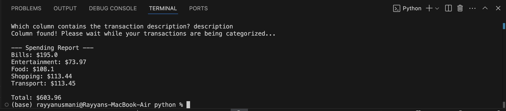
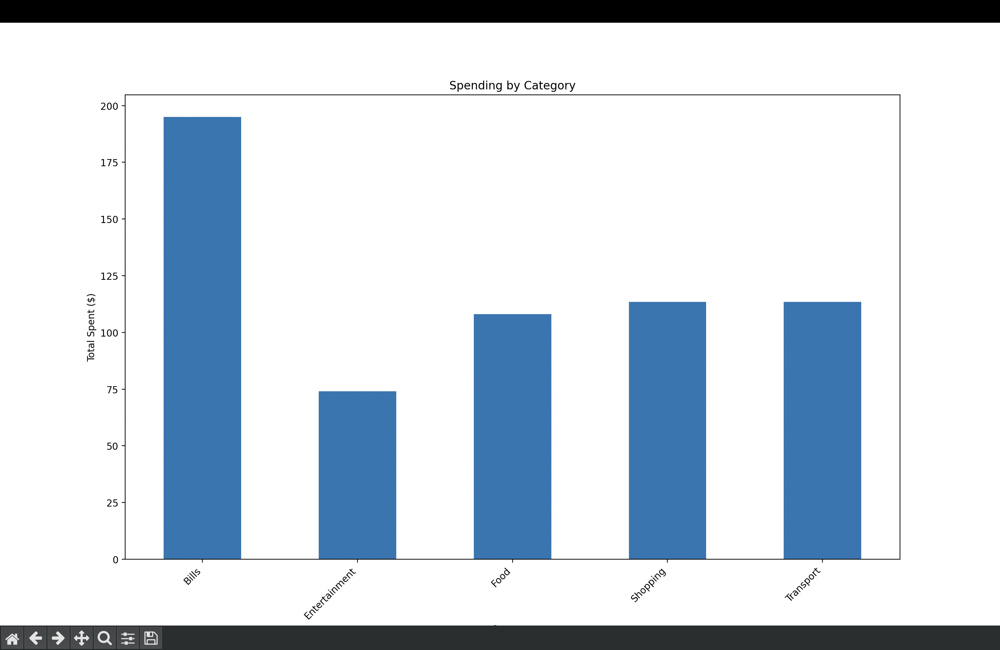

# Finance Analyzer

**Finance Analyzer** is a command-line data analysis tool that transforms any CSV of financial transactions into a clear spending breakdown. The project combines Pandas-powered data cleaning with Google Gemini AI to automatically categorize transactions and Matplotlib to visualize spending patterns across categories.

---

## Features

- **AI Categorization:** Uses Google Gemini AI to automatically classify transactions into spending categories like Food, Transport, Bills, and more.
- **Smart Data Cleaning:** Automatically handles missing values, duplicate rows, and invalid data before analysis.
- **Dynamic CSV Support:** Works with any CSV file; detects columns at runtime so it's not locked to a specific format.
- **Spending Visualization:** Generates a bar chart breakdown of spending by category using Matplotlib.
- **Terminal Report:** Prints a clean formatted spending summary with category totals and overall spend.

---

## Tech Stack

---

## Installation

1. Clone the repository: git clone https://github.com/rayyanusmanii/Finance-Analyzer.git
2. Install the required dependencies: pip install pandas matplotlib google-generativeai python-dotenv
3. Get a free Gemini API key from aistudio.google.com. Sign in with your Google account, click "Get API key", and copy it.
4. Create a .env file in the project folder and add your Gemini API key: GEMINI_API_KEY=your_api_key_here
5. Run the script: python main.py

---
